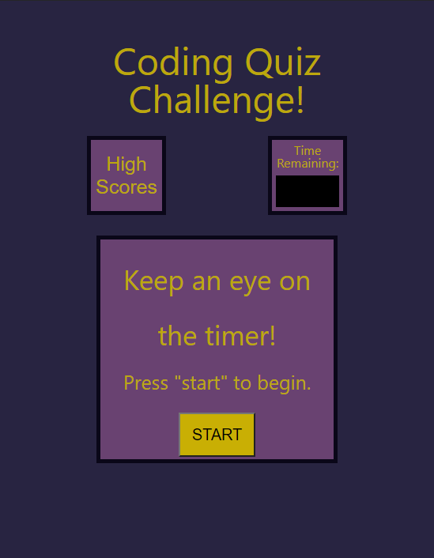

# code-quiz

## Create Code from Scratch

The purpose of this project was to practice writing code in JavaScript that allows a user to interact with a webpage to answer questions by clicking a button to select one of four answers displayed. Upon starting the quiz, a timer counts down from 60 seconds, and decrements an additional 5 seconds for every wrong answer. The user can briefly view a message displayed below the answer choices indicating whether their answer was correct or incorrect. At the end of the quiz, they may enter their name and click "submit" in order to save and view their score on the "High Scores" page, where they can also click a button to retake the quiz.

I learned the importance of organizing a project into steps that can be integrated piece by piece, as well as how to use comments to lay out next steps (as well as describe the function of lines) in my code. I became more proficient at using console.log and Chrome Dev Tools to track my progress and identify bugs. Additionally, I had opportunity to practice writing items to and retrieving them from Local Storage.

## Installation

N/A

## Usage

View the webpage and click the "Start" button to begin the quiz. Click on a button to answer each question before the timer runs out. Enter your name and click "submit" to save your score or "retake quiz" to try again. You may also click "High Scores" to view the currently saved high scores at any time.

View the webpage here: https://sarah-jensen.github.io/code-quiz/

## Credits

N/A

## License

Refer to the LICENSE in the repo.

---
